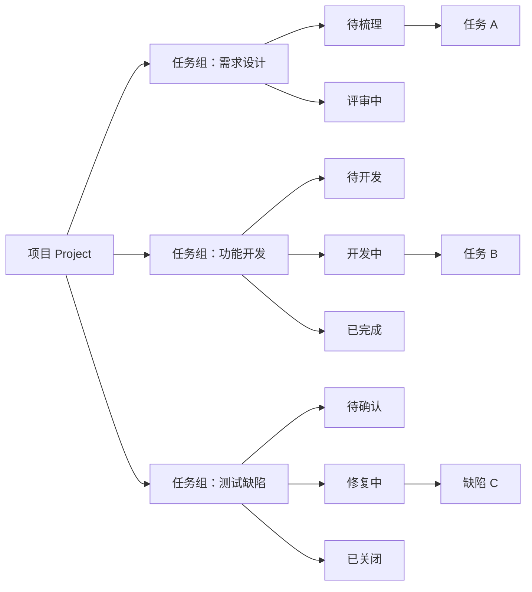
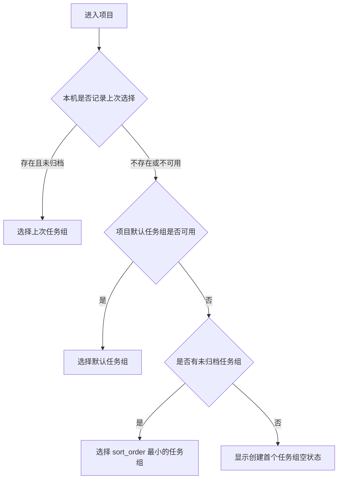
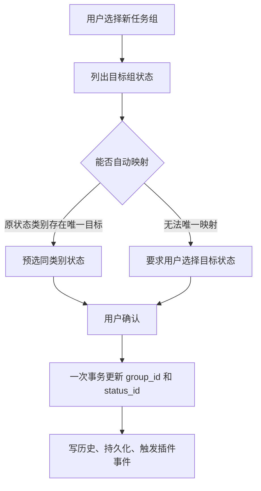
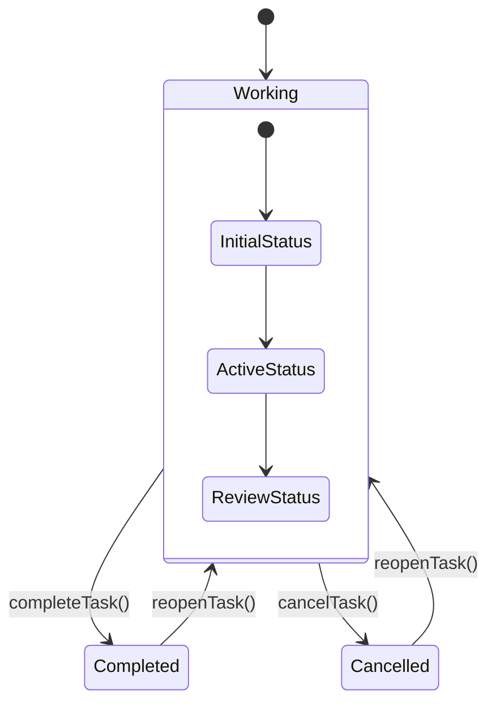
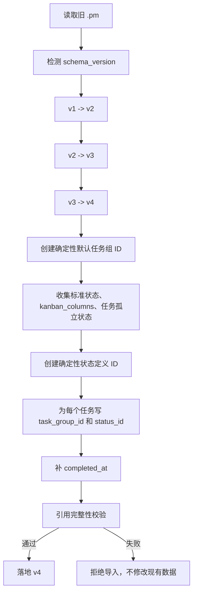
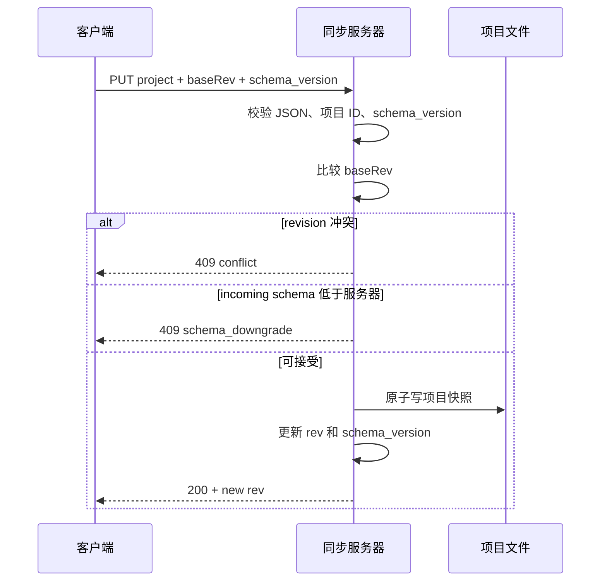

# 四级任务架构完整变更清单

> 文档状态：设计与实施规划  
> 适用版本：计划中的 `.pm schema_version = 4`  
> 目标架构：`项目 -> 任务组 -> 状态 -> 任务（卡片）`  
> 依据：本轮产品讨论、现有源码静态审计、当前数据格式与同步实现  
> 注意：本文档描述目标方案，不代表相关代码已经完成。

本文档用于统一产品设计、数据结构、界面交互、迁移兼容、同步安全、测试验收和发布顺序。开发过程中如改变本文定义的数据关系或状态语义，应先更新本文，再修改实现。

---

## 1. 变更目标

当前应用采用以下三级结构：

```text
项目 -> 状态 -> 任务
```

目标是升级为以下四级结构：

```text
项目 -> 任务组 -> 状态 -> 任务
```

任务组用于表达项目下相对独立的事项集合，例如：

- 需求设计
- 功能开发
- 测试缺陷跟进
- 上线准备
- 运营反馈

“任务组”是中性组织概念，不承担流程引擎、审批流或自动状态流转含义。

### 1.1 目标关系图



### 1.2 核心设计原则

1. 每个任务组拥有独立状态集合。
2. 看板一次只显示一个任务组，避免不同状态体系混排。
3. 任务继续保存在项目级扁平数组中，通过外键关联任务组和状态。
4. 跨任务组依赖、搜索、日历、时间线和统计必须继续可用。
5. 状态 ID、状态名称和状态业务语义必须分离。
6. 所有数据入口必须统一迁移、校验和序列化。
7. 新客户端不得被旧客户端或旧格式同步数据降级覆盖。

---

## 2. 决策状态

### 2.1 已确认的产品决定

| 编号 | 决定 | 状态 |
|---|---|---|
| D-01 | 新层级命名为“任务组” | 已确认 |
| D-02 | 主体层级为“项目 -> 任务组 -> 状态 -> 任务” | 已确认 |
| D-03 | 看板左侧增加任务组面板 | 已确认 |
| D-04 | 看板任务组面板展开宽度为 `256px` | 已确认 |
| D-05 | 看板默认展示首个可用任务组 | 已确认 |
| D-06 | 看板仅展示当前任务组的状态和任务 | 已确认 |
| D-07 | 项目页签仅保留看板、列表、日历、时间线、依赖图 | 已确认 |
| D-08 | 项目页签顺序为看板、列表、日历、时间线、依赖图 | 已确认 |
| D-09 | 项目页签移除概览、README、文件、统计、Git | 已确认 |
| D-10 | 项目导入、导出和存储能力必须在四级结构下保持 | 已确认 |

### 2.2 推荐采用的工程决定

| 编号 | 建议 | 原因 |
|---|---|---|
| R-01 | `Project.tasks` 保持扁平，不把任务嵌套到任务组 | 保留跨组依赖、统一搜索、日历、时间线和报告能力 |
| R-02 | 项目保存 `default_task_group_id` | 多设备同步时默认组一致 |
| R-03 | 最近选择的任务组保存在本机 UI 偏好中 | 不把用户设备上的浏览状态同步到其它设备 |
| R-04 | 状态增加语义类别 `todo/active/done/cancelled` | 统计、提醒、依赖和循环任务不再依赖状态名称 |
| R-05 | 每个任务组指定初始状态和完成状态 | 新建、完成、重开、循环任务都有确定目标 |
| R-06 | 任务增加 `completed_at` | 禁止继续用 `updated_at` 充当完成时间 |
| R-07 | `.pm` 升级到 `schema_version: 4` | 四级结构属于不兼容数据模型变化 |
| R-08 | 内部 `pm_projects` 也增加结构版本包装 | 当前原始数组绕过 `.pm` 迁移器，存在双格式风险 |
| R-09 | 服务器拒绝低版本 schema 覆盖高版本项目 | 防止旧客户端将 v4 项目降级写回 |
| R-10 | 新项目 UI 删除“项目级服务器地址”选项 | 当前该地址未被项目保存逻辑使用，真实同步由全局设置管理 |

### 2.3 实施前仍需最终确认的事项

| 编号 | 待确认事项 | 推荐默认值 |
|---|---|---|
| O-01 | `cancelled` 是否满足前置依赖 | 不满足，只允许 `done` 满足 |
| O-02 | 归档任务组是否进入全局仪表盘统计 | 默认不进入日常统计，仍进入完整导出和历史查询 |
| O-03 | 变更日志与手动版本发布是否保留 | UI 移除，旧数据保留；自动变更日志代码建议一并停用 |
| O-04 | 项目模板 `default/electron/hardware/web/todo` 是否继续展示 | 从新建项目 UI 移除，改成任务组预设 |
| O-05 | 独立的全局仪表盘是否保留 | 保留，它不是项目“概览”页签 |
| O-06 | 全屏流程图功能是否保留 | 单独决策，它不等同于依赖图页签 |

---

## 3. 功能范围调整

### 3.1 保留的项目视图

```text
1. 看板
2. 列表
3. 日历
4. 时间线
5. 依赖图
```

所有项目使用同一组视图，不再根据 `template === 'todo'` 切换视图集合。

### 3.2 移除的项目视图

| 视图 | 需要删除的入口 | 需要处理的附属能力 |
|---|---|---|
| 概览 | 页签、命令、快捷键、组件引用 | 项目日期、里程碑、版本日志、工时摘要、标签摘要 |
| README | 页签、编辑器、命令、文案 | `readme` 旧数据兼容、模板文件内容 |
| 文件 | 页签、扫描入口、命令、文案 | `fileTree`、目录扫描、模板虚拟文件 |
| 统计 | 页签、命令、组件 | 若全局仪表盘和报告仍使用统计工具，不可直接删除共享函数 |
| Git | 页签、命令、任务详情字段、设置项 | `git_repo_path`、Git 扫描模块、Git 相关 i18n |

### 3.3 被移除视图中的能力迁移

| 原能力 | 新位置或处理方式 |
|---|---|
| 项目名称、描述、颜色、开始/结束日期 | 新增“项目设置”对话框 |
| 里程碑查看与维护 | 迁移到时间线视图 |
| 工时启动和查看 | 列表行、任务详情继续保留 |
| 项目级工时摘要 | 如仍需要，放入全局仪表盘或报告，不恢复项目概览 |
| 变更日志和版本按钮 | 待产品确认；推荐取消 UI 和自动记录，只保留旧数据兼容 |
| README 内容 | 旧项目只读兼容并保留导入导出，不再生成新内容 |
| 文件树 | 旧数据保留，不在新 UI 中展示，不再为新项目扫描 |

---

## 4. 目标领域模型

### 4.1 TypeScript 示例

```ts
export type StatusCategory = 'todo' | 'active' | 'done' | 'cancelled';

export interface TaskStatusDefinition {
  id: string;
  name: string;
  color: string;
  category: StatusCategory;
  sort_order: number;
}

export interface TaskGroup {
  id: string;
  name: string;
  sort_order: number;
  archived: boolean;
  initial_status_id: string;
  completion_status_id: string;
  statuses: TaskStatusDefinition[];
}

export interface Project {
  id: string;
  name: string;
  default_task_group_id: string;
  task_groups: TaskGroup[];
  tasks: Task[];
  // 其余项目字段略
}

export interface Task {
  id: string;
  title: string;
  task_group_id: string;
  status_id: string;
  completed_at: string | null;
  status_before_closed_id?: string;
  // 其余任务字段略
}
```

### 4.2 字段职责

| 字段 | 持久化 | 作用 |
|---|---|---|
| `Project.task_groups` | 是 | 项目下完整任务组与状态定义 |
| `Project.default_task_group_id` | 是 | 新建任务、首次进入项目时的默认组 |
| `TaskGroup.initial_status_id` | 是 | 新建任务、循环任务下一实例和默认重开状态 |
| `TaskGroup.completion_status_id` | 是 | 快速完成操作的目标状态 |
| `TaskStatusDefinition.category` | 是 | 跨任务组统一业务判断与统计 |
| `Task.task_group_id` | 是 | 所属任务组外键 |
| `Task.status_id` | 是 | 所属状态外键 |
| `Task.completed_at` | 是 | 真正进入完成类别的时间 |
| `Task.status_before_closed_id` | 是，可选 | 完成后重新打开时恢复原工作阶段 |
| `last_selected_task_group_id` | 否，设备本地 | 当前设备上次浏览位置 |

### 4.3 必须建立的查询辅助函数

```ts
getTaskGroup(project, task): TaskGroup | null
getTaskStatus(project, task): TaskStatusDefinition | null
getStatusById(project, statusId): TaskStatusDefinition | null
getInitialStatus(group): TaskStatusDefinition
getCompletionStatus(group): TaskStatusDefinition
isTaskCompleted(project, task): boolean
isTaskClosed(project, task): boolean
satisfiesDependency(project, task): boolean
```

组件、报表、提醒和同步逻辑不得自行重复查找并判断 `status_id`。建议为每个项目建立派生索引：

```ts
interface ProjectTaskIndex {
  groupById: Map<string, TaskGroup>;
  statusById: Map<string, TaskStatusDefinition>;
  taskById: Map<string, Task>;
}
```

这样可避免在最多 20,000 个任务的项目中反复线性扫描状态定义。

### 4.4 状态语义矩阵

| 行为 | `todo` | `active` | `done` | `cancelled` |
|---|---:|---:|---:|---:|
| 计入未完成数量 | 是 | 是 | 否 | 否 |
| 计入完成数量 | 否 | 否 | 是 | 否 |
| 显示逾期 | 是 | 是 | 否 | 否 |
| 发送提醒 | 是 | 是 | 否 | 否 |
| 满足前置依赖 | 否 | 否 | 是 | 推荐否 |
| 触发循环任务下一实例 | 否 | 否 | 是 | 否 |
| 停止活动计时显示 | 否 | 否 | 是 | 是 |
| 使用完成删除线 | 否 | 否 | 是 | 使用独立“已取消”样式 |

### 4.5 数据不变量

必须在导入、创建、更新、同步拉取和备份恢复时验证以下规则：

- 项目至少有一个未归档任务组。
- `default_task_group_id` 必须指向未归档任务组。
- 每个任务组至少有一个状态。
- `initial_status_id` 必须属于当前任务组。
- `completion_status_id` 必须属于当前任务组，且类别为 `done`。
- 任务的 `task_group_id` 必须存在。
- 任务的 `status_id` 必须属于任务指定的任务组。
- 任务组 ID 在项目内唯一。
- 状态 ID 建议在项目内全局唯一。
- 任务 ID 在项目内唯一。
- 依赖目标必须是同一项目中存在的任务。
- 依赖图不得产生循环。
- `completed_at` 仅在任务进入 `done` 类别时存在。

---

## 5. 任务组选择与导航

### 5.1 默认选择顺序

进入一个项目时，按以下优先级选择任务组：



### 5.2 状态存储位置

```ts
// 项目数据，参与导出和同步
project.default_task_group_id

// 本机 UI 偏好，不参与导出和同步
localStorage['pm_last_task_group_by_project'] = {
  [projectId]: taskGroupId
};
```

### 5.3 从外部入口打开任务

搜索结果、提醒、依赖图节点或其它入口打开任务时，必须按顺序执行：

```text
选择项目 -> 选择任务所属任务组 -> 选择任务 -> 打开任务详情
```

只设置 `activeTaskId` 会导致任务因当前组过滤而不可见。

---

## 6. 看板改造

### 6.1 桌面布局

```text
┌─────────────── 项目主内容区域 ───────────────────────────────┐
│ 任务组面板 256px │ 当前任务组标题 / 操作                      │
│                  ├───────────────────────────────────────────┤
│ 功能开发      12 │ 待开发       开发中       已完成          │
│ 需求设计       5 │ ┌──────┐     ┌──────┐     ┌──────┐       │
│ 测试缺陷       8 │ │任务 A│     │任务 B│     │任务 C│       │
│                  │ └──────┘     └──────┘     └──────┘       │
│ + 新建任务组     │                                           │
└──────────────────┴───────────────────────────────────────────┘
```

### 6.2 面板内容

每个任务组列表项建议显示：

- 任务组名称
- 未关闭任务数量
- 当前选中状态
- 归档标记
- 更多菜单：重命名、设为默认、管理状态、归档、删除

面板底部提供“新建任务组”命令。状态管理建议使用独立对话框或抽屉，不在 `256px` 列表中直接堆叠复杂表单。

### 6.3 看板行为清单

- [ ] 看板不提供“全部任务组”。
- [ ] 看板列来自当前任务组的 `statuses`。
- [ ] 列顺序按 `sort_order`。
- [ ] 卡片按 `task_group_id + status_id` 过滤。
- [ ] 在列内新建任务时自动写入当前任务组和当前状态。
- [ ] 卡片跨列时只改变 `status_id`。
- [ ] 拖到完成类别状态时走显式完成逻辑。
- [ ] 循环任务拖入完成状态时生成下一实例。
- [ ] 卡片完成样式由状态类别决定，不比较字符串 `'done'`。
- [ ] 删除状态前检查是否有任务引用。
- [ ] 重命名状态只改名称，不改 ID，不移动任务。
- [ ] 切换任务组时关闭不属于新组的任务详情，或自动切回任务所属组。

### 6.4 排序策略

当前代码已经通过锚点把过滤区域下标换算为全量 `Project.tasks` 下标，因此本次不强制增加 `Task.sort_order`。

改造时必须把目标区域定义为：

```ts
const area = project.tasks.filter(
  task => task.task_group_id === activeGroupId && task.status_id === targetStatusId
);
```

然后继续复用 `resolveInsertIndex()` 和 `reorderTask()`。不得把列内下标直接传给全量任务数组。

### 6.5 响应式策略

| 可用宽度 | 任务组面板行为 |
|---|---|
| 宽屏 | 固定显示 `256px` |
| 中等宽度 | 折叠为窄图标栏或标题按钮，用户可展开 |
| 手机/窄屏 | 使用覆盖式抽屉，选择后自动关闭 |

需要同时验证全局项目侧栏 `264px`、任务详情 `340px` 和看板列最小宽度 `248px` 的组合，避免主内容被压缩到不可用。

---

## 7. 列表改造

### 7.1 筛选器

列表顶部增加任务组选择器：

```text
[全部任务组 v] [全部状态 v] [优先级 v] [标签 v] [搜索]
```

状态筛选遵循以下规则：

| 任务组筛选 | 状态筛选内容 |
|---|---|
| 选中具体任务组 | 该组实际状态定义 |
| 全部任务组 | 统一语义类别：待处理、进行中、已完成、已取消 |

### 7.2 列表展示

- [ ] 每个任务显示任务组名称或徽标。
- [ ] 每个任务显示实际状态名称，不显示状态 ID。
- [ ] 完成样式使用状态类别。
- [ ] 逾期判断使用 `isTaskClosed()`。
- [ ] 全部任务组模式下同名任务可通过组名区分。
- [ ] 新建任务必须有明确目标任务组和状态。

### 7.3 新建任务目标

| 当前筛选 | 新建任务行为 |
|---|---|
| 具体任务组 + 具体状态 | 直接创建到当前组和状态 |
| 具体任务组 + 全部状态 | 创建到该组初始状态 |
| 全部任务组 | 使用项目默认任务组，或在输入框旁显示任务组选择器 |

推荐在“全部任务组”模式下显示目标任务组选择器，避免用户无感地把任务创建到错误位置。

---

## 8. 日历改造

- [ ] 增加“全部任务组 / 单个任务组”选择器。
- [ ] 日历任务显示任务组简称或颜色标记。
- [ ] 状态显示实际状态名称。
- [ ] 完成判断使用状态类别。
- [ ] 已取消任务默认不显示逾期。
- [ ] 点击任务时自动切换到任务所属任务组。
- [ ] 同一天任务较多时，组名不能挤压标题或造成重叠。
- [ ] 移动端月视图需要验证长任务组名称的截断与提示。

---

## 9. 时间线改造

- [ ] 增加任务组选择器，允许查看全部任务组。
- [ ] 全部模式按任务组分区或显示任务组列。
- [ ] 状态颜色来自状态定义。
- [ ] 图例根据当前筛选动态生成，不能固定为三状态。
- [ ] 依赖排期继续允许跨任务组。
- [ ] 跨组依赖线使用视觉标识，但不改变依赖语义。
- [ ] 里程碑 CRUD 从概览迁入时间线。
- [ ] 里程碑继续保持项目级，不强制归属任务组。
- [ ] 单组过滤时仍显示项目里程碑，标记为项目级锚点。
- [ ] 完成时间和工时计算使用 `completed_at`。

---

## 10. 依赖图改造

- [ ] 增加“全部任务组 / 单个任务组”选择器。
- [ ] 节点显示任务组名称、状态名称和状态颜色。
- [ ] 全部模式保留所有跨组依赖边。
- [ ] 单组模式下，外部依赖节点可显示为简化的边界节点。
- [ ] 不得因为过滤隐藏端点而把依赖当作已删除。
- [ ] 点击节点自动选择对应任务组并打开任务详情。
- [ ] 图例按状态类别或当前状态集合动态生成。
- [ ] 循环依赖检测继续基于任务 ID，不受任务组影响。

---

## 11. 任务详情改造

### 11.1 字段顺序

建议任务详情顶部字段顺序为：

```text
标题
任务组
状态
优先级
描述
日期与提醒
标签
子任务
依赖
循环规则
工时
评论
```

### 11.2 切换任务组

任务组变化与状态变化必须作为一个原子操作提交：

```ts
moveTaskToGroup(
  projectId,
  taskId,
  targetTaskGroupId,
  targetStatusId
);
```

推荐交互：



即使能够预选，也建议让用户确认目标状态，避免状态名称相似但业务含义不同。

### 11.3 字段可见性设置

- [ ] 在任务字段设置中增加 `task_group`。
- [ ] `task_group` 建议作为结构字段始终可见。
- [ ] `status` 继续可配置时，至少在详情标题区显示当前状态摘要。
- [ ] 删除 `git_repo_path` 字段和对应设置文案。

---

## 12. 任务组与状态管理

### 12.1 任务组操作

| 操作 | 规则 |
|---|---|
| 新建 | 至少创建一个初始状态和一个完成状态 |
| 重命名 | 不改变 ID，不影响任务引用 |
| 排序 | 修改 `sort_order`，参与 `.pm` 和同步 |
| 设为默认 | 更新 `Project.default_task_group_id` |
| 归档 | 隐藏于日常视图，禁止新建任务，保留任务与引用 |
| 恢复归档 | 重新进入可选列表 |
| 删除空组 | 允许，但不能删除唯一未归档组 |
| 删除非空组 | 必须先迁移任务或显式确认删除任务，推荐只提供迁移后删除 |

### 12.2 状态操作

| 操作 | 规则 |
|---|---|
| 新建 | 生成稳定 ID，指定名称、颜色、类别和排序 |
| 重命名 | 只改名称，不改 ID |
| 改颜色 | 不影响状态语义 |
| 改类别 | 需要提示会影响提醒、统计、依赖和循环任务 |
| 排序 | 只改变看板列顺序 |
| 删除未引用状态 | 允许 |
| 删除已引用状态 | 必须选择同组目标状态并批量迁移 |
| 删除初始状态 | 先指定新的初始状态 |
| 删除完成状态 | 先指定新的完成状态 |

### 12.3 状态类别变更风险提示

将状态从 `active` 改为 `done` 等同于批量改变该状态下所有任务的业务语义。推荐对话框显示：

```text
此状态下有 18 个任务。
改为“已完成”类别后，这些任务将停止提醒、停止逾期提示，并可能满足其它任务的前置依赖。

[取消] [确认修改]
```

是否为存量任务补写 `completed_at` 应单独询问。推荐使用修改时间作为迁移回退值，并在数据迁移日志中记录。

---

## 13. 任务创建、完成、重开和循环

### 13.1 创建任务

新签名建议：

```ts
createTask({
  projectId,
  taskGroupId,
  statusId,
  title
}): Task
```

校验顺序：

```text
项目存在
-> 任务组存在且未归档
-> 状态存在且属于该任务组
-> 构造任务
-> 写撤销历史
-> 更新项目
-> 生成 .pm 快照
-> 触发插件事件
```

### 13.2 完成与重新打开流程



完成逻辑建议：

```ts
function completeTask(project: Project, task: Task): Task {
  const group = getTaskGroup(project, task);
  const completion = getCompletionStatus(group);

  assertDependenciesCompleted(project, task);

  return {
    ...task,
    status_before_closed_id: task.status_id,
    status_id: completion.id,
    completed_at: new Date().toISOString()
  };
}
```

重新打开逻辑建议：

```ts
function reopenTask(project: Project, task: Task): Task {
  const group = getTaskGroup(project, task);
  const preferred = group.statuses.find(
    status => status.id === task.status_before_closed_id &&
      status.category !== 'done' &&
      status.category !== 'cancelled'
  );

  return {
    ...task,
    status_id: preferred?.id ?? group.initial_status_id,
    completed_at: null
  };
}
```

### 13.3 循环任务

- [ ] 原任务进入所属任务组的完成状态。
- [ ] 新实例保留原任务的 `task_group_id`。
- [ ] 新实例状态设置为该任务组的 `initial_status_id`。
- [ ] 新实例 `completed_at = null`。
- [ ] 新实例清空 `status_before_closed_id`。
- [ ] 子任务完成状态重置。
- [ ] 评论、提醒和计时按现有规则重置。
- [ ] 进入 `cancelled` 不生成下一实例。
- [ ] 只有显式完成操作或进入 `done` 类别才消费循环规则。

---

## 14. 依赖关系

### 14.1 数据结构

依赖继续只保存目标任务 ID，不增加任务组 ID：

```ts
interface Dependency {
  taskId: string;
  dayOffset: number;
}
```

任务组可通过目标任务实时解析，避免任务移动组后依赖记录过期。

### 14.2 完成约束

```ts
function satisfiesDependency(project: Project, task: Task): boolean {
  return getTaskStatus(project, task)?.category === 'done';
}
```

默认不把 `cancelled` 视为满足依赖。若业务以后需要“取消也解除阻塞”，应增加项目级明确配置，不要散落特殊判断。

### 14.3 依赖选择器

```text
功能开发 / 实现登录接口
功能开发 / 接入登录页面
测试缺陷 / 修复登录超时
```

选择器应支持按任务组分组、搜索任务标题，并对已完成任务显示状态。

---

## 15. 搜索、提醒和全局仪表盘

### 15.1 全局搜索

搜索范围扩展为：

- 项目名称与描述
- 任务组名称
- 任务标题与描述
- 子任务标题

任务和子任务结果增加：

```ts
interface SearchResult {
  projectId: string;
  taskGroupId?: string;
  taskGroupName?: string;
  taskId?: string;
  statusName?: string;
  completed: boolean;
}
```

完成样式通过状态类别计算，不再比较 `task.status === 'done'`。

### 15.2 提醒

当前提醒轮询会把项目任务拍平成 `Task[]`，新实现应保留上下文：

```ts
interface ReminderCandidate {
  project: Project;
  taskGroup: TaskGroup;
  status: TaskStatusDefinition;
  task: Task;
}
```

通知正文建议：

```text
项目：移动端改版
任务组：测试缺陷跟进
任务：修复登录超时
```

提醒过滤使用 `isTaskClosed()`，已完成和已取消任务均不提醒。

### 15.3 全局仪表盘

- [ ] 按状态类别汇总，不按状态 ID 汇总。
- [ ] 可展示项目数量、任务总数、进行中、已完成、已取消。
- [ ] 即将到期和逾期任务使用关闭语义过滤。
- [ ] 任务项显示项目名和任务组名。
- [ ] 点击任务自动选择项目、任务组和任务。
- [ ] 默认排除已归档项目和已归档任务组。
- [ ] 完成率只计算 `done`，不把 `cancelled` 计为完成。

---

## 16. 工时统计

当前实现使用 `updated_at - tracked_start` 计算已完成任务工时。进入四级结构后，任务可能在完成后被重命名、移动任务组或修改状态定义，`updated_at` 会继续变化，因此必须修正。

### 16.1 最小改造

```ts
duration = completed_at - tracked_start
```

旧任务迁移规则：

```text
旧状态为 done -> completed_at = updated_at
其它状态 -> completed_at = null
```

### 16.2 后续可选升级

如果未来允许暂停和恢复计时，应从单个 `tracked_start` 升级为时间段数组。本次四级结构改造不强制实现。

---

## 17. AI 功能

### 17.1 进度报告

不得再给 AI 传递原始状态 ID：

```text
- [功能开发 / 开发中 / active] 接入支付接口
- [测试缺陷 / 已关闭 / done] 修复金额精度问题
```

系统提示应说明：

- 状态名称由用户自定义。
- `category` 才是统计语义。
- 报告按任务组组织。
- `cancelled` 单独统计，不计入完成率。

### 17.2 任务拆解

任务上下文增加：

```ts
{
  task_group_name: string;
  status_name: string;
  status_category: StatusCategory;
}
```

### 17.3 项目报告数据

侧边栏和命令面板当前自行拼接 `- [status] title`。应抽出统一的 AI 项目上下文生成器，避免两套格式继续漂移。

---

## 18. 导入、导出与 `.pm` v4

### 18.1 v4 示例

```jsonc
{
  "version": "1.0",
  "schema_version": 4,
  "project": {
    "id": "project-1",
    "name": "移动端改版",
    "description": "",
    "color": "#a33b32",
    "created_at": "2026-09-01T00:00:00.000Z",
    "updated_at": "2026-09-29T10:00:00.000Z",
    "archived": false,
    "default_task_group_id": "group-dev",
    "sync_enabled": true,
    "sort_order": 1024
  },
  "task_groups": [
    {
      "id": "group-dev",
      "name": "功能开发",
      "sort_order": 1024,
      "archived": false,
      "initial_status_id": "status-dev-todo",
      "completion_status_id": "status-dev-done",
      "statuses": [
        {
          "id": "status-dev-todo",
          "name": "待开发",
          "color": "#6b7280",
          "category": "todo",
          "sort_order": 1024
        },
        {
          "id": "status-dev-doing",
          "name": "开发中",
          "color": "#4f46e5",
          "category": "active",
          "sort_order": 2048
        },
        {
          "id": "status-dev-done",
          "name": "已完成",
          "color": "#10b981",
          "category": "done",
          "sort_order": 3072
        }
      ]
    }
  ],
  "tasks": [
    {
      "id": "task-1",
      "title": "实现登录接口",
      "task_group_id": "group-dev",
      "status_id": "status-dev-doing",
      "completed_at": null,
      "priority": "high",
      "dependencies": [],
      "subtasks": [],
      "comments": [],
      "created_at": "2026-09-20T00:00:00.000Z",
      "updated_at": "2026-09-29T10:00:00.000Z"
    }
  ],
  "tags": [],
  "milestones": [],
  "changelog": []
}
```

`.pm` 继续使用 UTF-8 JSON 和 `.pm` 扩展名，历史人类可读字段 `version: "1.0"` 保持不变，机器结构版本由 `schema_version` 表达。

示例未展开 README、虚拟模板文件、流程图、变更日志和任务 Git 路径等遗留数据。v4 schema 应允许这些字段作为可选 legacy 数据存在：新项目不再生成，旧项目仅在原数据存在时继续输出，从而同时满足“停止新增无用数据”和“旧项目无损往返”。

### 18.2 完整项目导出原则

- [ ] `.pm` 永远导出完整项目。
- [ ] 不提供只含当前任务组的 `.pm`，避免产生不可合并的项目碎片。
- [ ] Markdown、HTML、PDF 等报告可选当前任务组或全部任务组。
- [ ] `storage` 继续作为设备本地配置，不写入 `.pm`。
- [ ] 所有导出统一调用 `projectToPm()`。

### 18.3 v1/v2/v3 到 v4 迁移

旧项目统一创建一个“默认任务组”，不从标题、标签或描述猜测多个任务组。



### 18.4 旧状态映射

| 旧值 | 新名称 | 新类别 |
|---|---|---|
| `todo` | 待办 | `todo` |
| `in_progress` | 进行中 | `active` |
| `done` | 已完成 | `done` |
| `待办` | 待办 | `todo` |
| `进行中` | 进行中 | `active` |
| `已完成` | 已完成 | `done` |
| 其它自定义值 | 原样保留 | 推荐 `todo`，并产生迁移警告 |

未知状态不得静默映射到已有状态，也不得丢弃。选择 `todo` 作为默认类别比误判完成更安全，因为它不会错误停止提醒、满足依赖或提高完成率。

### 18.5 自定义看板列迁移

迁移顺序：

1. 先按旧 `kanban_columns` 顺序创建状态定义。
2. 再扫描任务中实际出现的状态。
3. 不在列定义中的孤立状态追加到末尾。
4. 同名状态只创建一次。
5. 任务状态引用转换为新状态 ID。

### 18.6 确定性 ID

迁移生成的 ID不得使用随机 UUID，否则相同旧项目在两台设备分别迁移会产生不同 ID，随后同步会制造冲突。

示例：

```ts
legacyGroupId = stableHash(`v4:group:${projectStableKey}:default`);
legacyStatusId = stableHash(
  `v4:status:${projectStableKey}:${legacyStatusValue}`
);
```

`projectStableKey` 优先使用项目 ID；历史文件没有 ID 时，可使用不会被本次迁移改变的稳定字段组合并记录警告。

### 18.7 新版本拒绝策略

```ts
if (incomingSchema > CURRENT_PM_SCHEMA) {
  return error(
    `该项目使用 schema v${incomingSchema}，当前客户端仅支持 v${CURRENT_PM_SCHEMA}`
  );
}
```

不得继续采用“版本大于等于当前版本就原样放行”的逻辑。

---

## 19. 内部存储升级

### 19.1 当前问题

当前 `localStorage['pm_projects']` 保存原始 `Project[]`，启动时不走 `.pm` 迁移链。升级四级结构后，内部存储和 `.pm` 不能继续使用两套迁移方式。

### 19.2 目标格式

```jsonc
{
  "schema_version": 4,
  "projects": [
    { "id": "...", "task_groups": [], "tasks": [] }
  ]
}
```

### 19.3 启动迁移流程

```text
读取 pm_projects
-> 识别旧数组或新包装对象
-> 保存迁移前备份
-> 对每个项目执行 v4 迁移
-> 校验全部项目
-> 原子写回 pm_projects
-> 重写 pm_file_<projectId>
-> 所有成功后标记迁移完成
-> 归属设备异步更新外部 .pm 副本
```

任何项目迁移失败时，禁止覆盖原始 `pm_projects`。错误提示应包含项目名称和字段路径。

### 19.4 双快照一致性

以下两份数据必须始终一致：

```text
pm_projects
pm_file_<projectId>
```

同步上传读取的是第二份。所有任务组、状态和任务修改，包括撤销/重做，都必须同时更新两份。

---

## 20. 本地文件夹与文件名

### 20.1 存储事实

项目始终保存到应用内部。用户选择本地文件夹时，只是额外写入一份 `.pm` 副本，不是把本地文件夹变成唯一主存储。

### 20.2 新建项目 UI

推荐文案与控件：

```text
[x] 保存到应用内部
[ ] 同时保存 .pm 副本到本地文件夹
[x] 参与全局同步
```

删除项目级“服务器存储 URL”，同步地址继续在全局设置中配置。

### 20.3 文件名

当前 `<项目名>.pm` 存在同名项目冲突和项目改名后的旧文件残留问题。推荐：

```text
<safe-project-name>-<project-id-prefix>.pm
```

示例：

```text
移动端改版-a81f27c4.pm
```

项目改名时需要决定旧文件处理方式。推荐写新文件成功后，将旧文件移动为 `.bak` 或提示用户清理，不直接无提示删除。

---

## 21. 备份与恢复

- [ ] 全量备份中的每个项目都使用 v4 `projectToPm()`。
- [ ] 备份包顶层 `schema_version` 升级到 4（当前实现与项目 schema 共用版本号）。
- [ ] 后续如备份容器独立演进，再拆分 `backup_schema_version` 与项目 `schema_version`，本次不强制扩展范围。
- [ ] 备份恢复中的每个项目单独走 `parsePmText()`。
- [ ] v1/v2/v3 项目可在备份包中混合存在并逐个迁移。
- [ ] 未来 schema 项目应跳过并明确报告，不可按旧格式恢复。
- [ ] 同 ID 项目合并前先完成 schema 迁移。
- [ ] 合并后重写 `pm_file_<id>`。
- [ ] 恢复不得覆盖设备本地 `storage` 路径和归属设备信息。
- [ ] 恢复报告显示新增、替换、跳过和迁移来源版本。

---

## 22. 云同步与降级保护

### 22.1 客户端同步

- [ ] 上传前确认 `pm_file_<id>` 是 v4 且与内存项目一致。
- [ ] 拉取后统一走 `parsePmText()`。
- [ ] 不支持更高 schema 时停止应用远端数据并提示升级客户端。
- [ ] 冲突对话框显示本地与远端 schema 版本。
- [ ] 强制选择本地或远端时仍执行 schema 降级检查。
- [ ] 迁移后的远端项目写入内部快照和项目列表。

### 22.2 服务端保护

服务器索引元数据增加：

```ts
interface ServerProjectMeta {
  name: string;
  rev: number;
  updated_at: string;
  schema_version: number;
  deleted?: boolean;
}
```

PUT 流程：



至少禁止以下情况：

```text
服务器项目 schema = 4
旧客户端上传 schema = 3
结果：拒绝覆盖
```

---

## 23. 撤销与重做

### 23.1 快照内容

```ts
interface HistoryEntry {
  projects: Project[];
  activeProjectId: string | null;
  activeTaskGroupId: string | null;
  activeTaskId: string | null;
}
```

### 23.2 必须可撤销的操作

- [ ] 新建、重命名、排序、归档、恢复和删除任务组。
- [ ] 新建、重命名、排序、改类别和删除状态。
- [ ] 任务跨状态移动。
- [ ] 任务跨任务组移动。
- [ ] 完成、重新打开和取消任务。
- [ ] 删除状态时的批量任务迁移。
- [ ] 删除任务组时的批量任务迁移。

### 23.3 持久化修复

当前撤销只恢复 store，不会重写 `pm_file_<id>`。新实现应通过统一的 `applyProjectSnapshot()` 或 repository transaction：

```text
恢复历史快照
-> 找出发生变化的项目
-> 写 pm_projects
-> 为变化项目重写 pm_file_<id>
-> 必要时更新外部副本
-> 通知同步引擎项目已变化
```

删除项目后的撤销还需要处理同步墓碑，避免本地恢复后再次被服务器删除。这一项应单独编写集成测试。

---

## 24. 人类可读报告导出

### 24.1 Markdown

推荐结构：

```markdown
# 移动端改版

## 功能开发

### 开发中

- [ ] 接入支付接口

### 已完成

- [x] 完成登录接口

## 测试缺陷跟进

### 修复中

- [ ] 修复登录超时
```

### 24.2 HTML/PDF

- [ ] 摘要按语义类别统计。
- [ ] 主体按任务组和状态分节。
- [ ] 任务显示实际状态颜色。
- [ ] 逾期任务排除已关闭状态。
- [ ] 完成率不包含已取消任务。
- [ ] 可选择“全部任务组”或单个任务组。
- [ ] `.pm` 导出不受报告筛选影响，仍导出完整项目。

---

## 25. 插件兼容

### 25.1 事件负载

```ts
onTaskCreate: {
  projectId: string;
  taskGroupId: string;
  task: Task;
}

onTaskStatusChange: {
  projectId: string;
  taskId: string;
  taskGroupId: string;
  fromStatusId: string;
  toStatusId: string;
  fromCategory: StatusCategory;
  toCategory: StatusCategory;
}

onTaskGroupChange: {
  projectId: string;
  taskId: string;
  fromTaskGroupId: string;
  toTaskGroupId: string;
  toStatusId: string;
}
```

可选新增事件：

```text
onTaskGroupCreate
onTaskGroupUpdate
onTaskGroupDelete
onStatusDefinitionCreate
onStatusDefinitionUpdate
onStatusDefinitionDelete
```

### 25.2 兼容策略

四级结构会改变插件看到的 `Project` 和 `Task` 形状，属于不兼容 API 变化。推荐：

- 提升应用/插件 API 主版本。
- 插件上下文暴露明确的 `apiVersion`。
- 对旧插件给出“不兼容”提示，不伪造旧 `status` 字段。
- 更新 `docs/PLUGINS.md` 和示例插件。

---

## 26. 命令面板、快捷键、教程和 i18n

### 26.1 视图命令

```text
1 -> 看板
2 -> 列表
3 -> 日历
4 -> 时间线
5 -> 依赖图
```

删除概览、README、文件、统计、Git 的命令和快捷键。

### 26.2 任务命令

- [ ] 新建任务命令感知当前任务组。
- [ ] “全部任务组”模式下提示选择目标组。
- [ ] 状态筛选命令动态生成。
- [ ] 单组模式提供实际状态命令。
- [ ] 全部模式提供状态类别命令。
- [ ] 增加切换任务组命令。
- [ ] 增加新建任务组命令。

### 26.3 教程

教程更新为：创建项目、创建任务组、管理状态、在看板创建任务、跨列移动、切换五个视图、打开任务详情。

### 26.4 i18n

新增中英文文案至少包括：

```text
任务组、默认任务组、归档任务组、恢复任务组
新建任务组、重命名、设为默认、管理状态
初始状态、完成状态、状态类别
待处理、进行中、已完成、已取消
迁移任务后删除、目标任务组、目标状态
不支持的数据格式版本、禁止 schema 降级
```

默认状态名称可按创建时语言生成。用户自定义名称属于数据内容，切换应用语言后不自动翻译。

---

## 27. 新建项目改造

### 27.1 新项目最小数据

新项目必须立即创建：

```text
1 个默认任务组
3 个默认状态：待办、进行中、已完成
initial_status_id = 待办
completion_status_id = 已完成
default_task_group_id = 默认任务组
```

### 27.2 可选任务组预设

如果保留模板概念，建议改为任务组预设而不是文件模板：

| 预设 | 任务组示例 |
|---|---|
| 空白 | 默认任务组 |
| 软件开发 | 需求设计、功能开发、测试缺陷 |
| 产品迭代 | 需求池、设计、开发、验证、发布 |
| 个人事务 | 待处理事项 |

预设只在创建时展开为普通任务组和状态数据，项目之后不依赖预设类型运行。

### 27.3 项目存储

创建界面明确表达：

- 应用内部存储始终开启。
- 本地文件夹是可选额外副本。
- 云同步是项目级开关，服务器地址在全局设置管理。

---

## 28. 旧字段和旧功能数据策略

| 字段 | 新项目 | 旧项目读取 | v4 导出 | 后续处理 |
|---|---|---|---|---|
| `kanban_columns` | 不再生成 | 仅迁移器读取 | 推荐不写 | v5 可正式删除 |
| `Task.status` | 不再生成 | 仅迁移器读取 | 不写 | v5 可正式删除 |
| `template` | 不再作为新项目运行时依赖 | 保留 | 原数据存在时输出 | 改为可选 legacy 字段 |
| `readme` / template files | 不再生成 | 保留 | 原数据存在时输出 | 后续提供遗留数据清理工具 |
| `fileTree` | 不再扫描 | 本地保留 | 当前本就不进入 `.pm` | 停止使用 |
| `changelog` | 待确认 | 保留 | 原数据存在时输出 | 取消自动生成后可只读 |
| `flowchart` | 待确认 | 保留 | 原数据存在时输出 | 取决于全屏流程图决策 |
| `git_repo_path` | 不再生成 | 保留或迁移警告 | 原数据存在时输出 | 确认后删除 |

迁移阶段优先保证无损。隐藏 UI 不等于立即删除旧数据。

---

## 29. 源码模块变更清单

### 29.1 类型与领域模型

| 文件 | 改造事项 |
|---|---|
| `src/lib/types/task.ts` | 删除运行时固定 `TaskStatus`；任务增加组、状态引用和完成时间 |
| `src/lib/types/project.ts` | 增加 `TaskGroup`、`TaskStatusDefinition`、默认任务组；标记遗留字段 |
| `src/lib/types/pm-file.ts` | 增加 v4 任务组结构；更新项目元数据；保留必要遗留字段 |
| `src/lib/types/index.ts` | 导出新增类型 |
| `src/lib/types.ts` | 更新聚合导出 |
| 新建 `src/lib/utils/task-status.ts` | 集中提供状态解析和语义判断 |
| 新建 `src/lib/utils/project-index.ts` | 构建 group/status/task 索引，避免重复扫描 |

### 29.2 Store 与业务操作

| 文件 | 改造事项 |
|---|---|
| 新建 `src/lib/stores/task-group.ts` | 任务组 CRUD、状态 CRUD、归档、排序和删除保护 |
| `src/lib/stores/task.ts` | 创建、移动、完成、重开、取消、循环任务和依赖判断全部改用新模型 |
| `src/lib/stores/filter.ts` | 增加活动任务组、任务组过滤、动态状态/类别过滤 |
| `src/lib/stores/history.ts` | 快照加入活动任务组；恢复后统一持久化 `.pm` |
| `src/lib/stores/project.ts` | 新建项目默认组；v4 导入转换；迁移项目设置能力 |
| `src/lib/stores/search.ts` | 搜索任务组；结果增加组上下文和语义完成状态 |
| `src/lib/stores/task-fields.ts` | 增加任务组字段，删除 Git 字段 |
| `src/lib/stores/index.ts` | 导出新增 store 和操作 |

### 29.3 五个保留视图

| 文件 | 改造事项 |
|---|---|
| `src/lib/components/views/Kanban.svelte` | `256px` 任务组面板、动态列、组内过滤和状态管理入口 |
| `src/lib/components/views/TaskList.svelte` | 任务组筛选、动态状态筛选、组徽标和明确新建目标 |
| `src/lib/components/views/Calendar.svelte` | 任务组筛选、动态状态显示、关闭语义判断 |
| `src/lib/components/views/Timeline.svelte` | 任务组筛选、动态图例、跨组依赖、里程碑管理 |
| `src/lib/components/views/TaskGraph.svelte` | 组徽标、跨组边、动态状态颜色和过滤边界节点 |

### 29.4 详情与共享组件

| 文件 | 改造事项 |
|---|---|
| `src/lib/components/TaskDetail.svelte` | 任务组选择、动态状态、原子跨组移动、删除 Git 组件 |
| `src/lib/components/task-detail/TaskDetailDependencies.svelte` | 按任务组分组、显示组名、跨组选择 |
| `src/lib/components/task-detail/TaskDetailTimeTracking.svelte` | 用状态语义和 `completed_at` |
| `src/lib/components/task-detail/TaskDetailRecurrence.svelte` | 说明新实例继承组并回到初始状态 |
| `src/lib/components/shared/GlobalSearch.svelte` | 结果显示任务组；打开时选中任务组 |
| `src/lib/components/shared/CommandPalette.svelte` | 五视图命令、动态状态筛选、任务组命令 |
| `src/lib/components/shared/Tutorial.svelte` | 更新任务组与五视图教程 |
| `src/lib/components/shared/ShortcutHelp.svelte` | 更新视图数字快捷键 |

### 29.5 页面与布局

| 文件 | 改造事项 |
|---|---|
| `src/routes/+page.svelte` | 只保留五个视图及新顺序；移除模板特判和旧组件引用 |
| `src/routes/+layout.svelte` | 提醒轮询保留项目和任务组上下文 |
| `src/lib/components/layout/Sidebar.svelte` | 新建项目预设、存储文案、AI 上下文和导入入口更新 |

### 29.6 数据、导出和同步

| 文件 | 改造事项 |
|---|---|
| `src/lib/utils/pm-schema.ts` | `CURRENT_PM_SCHEMA = 4`、v3->v4、引用校验、拒绝未来版本 |
| `src/lib/repositories/project-repo.ts` | 版本化 `pm_projects`、启动迁移和失败回滚 |
| `src/lib/repositories/pm-file-repo.ts` | v4 序列化、任务组输出、遗留字段策略 |
| `src/lib/utils/backup.ts` | v4 全量备份、混合版本恢复和迁移报告 |
| `src/lib/utils/markdown.ts` | 按任务组和状态分节 |
| `src/lib/utils/html-export.ts` | 动态状态、任务组分节和语义统计 |
| `src/lib/utils/report-export.ts` | 增加任务组范围参数，不影响 `.pm` 完整导出 |
| `src/lib/utils/stats.ts` | 使用类别、`completed_at` 和关闭语义 |
| `src/lib/utils/reminder.ts` | 接收项目/任务组上下文，使用关闭语义 |
| `src/lib/sync/auto.ts` | v4 快照一致性、拉取错误、迁移后重写 |
| `src/lib/sync/server.ts` | 识别 schema 降级响应 |
| `src/lib/sync/types.ts` | 同步元数据增加 schema 版本 |
| `server/pm-sync-server.mjs` | 服务端记录 schema 并拒绝降级覆盖 |
| `src/lib/utils/local-file-target.ts` | 文件名加入项目 ID 前缀，处理改名遗留文件 |

### 29.7 AI、插件与文档

| 文件 | 改造事项 |
|---|---|
| `src/lib/ai/prompts.ts` | 删除固定三状态假设，解释动态状态和类别 |
| `src/lib/ai/index.ts` | 扩展任务和项目上下文 |
| `src/lib/plugins/types.ts` | 新事件负载、API 版本和组/状态事件 |
| `src/lib/plugins/builtin/example-plugin.ts` | 更新示例 |
| `docs/DATA-FORMAT.md` | 更新 v4、内部存储、迁移、状态语义 |
| `docs/PLUGINS.md` | 更新插件 API |
| `README.md` | 更新层级、五视图、截图、快捷键和数据说明 |
| `src/lib/i18n/zh.ts` | 新增中文文案，删除旧入口文案 |
| `src/lib/i18n/en.ts` | 对齐英文文案 |

### 29.8 待删除或停用模块

确认旧功能不再需要后处理：

```text
src/lib/components/ProjectInfo.svelte
src/lib/components/ProjectReadme.svelte
src/lib/components/ProjectFiles.svelte
src/lib/components/views/Stats.svelte
src/lib/components/views/GitLog.svelte
src/lib/components/task-detail/TaskDetailGit.svelte
src/lib/git/*
src/lib/components/settings/SettingsGit.svelte
```

删除前先用引用搜索确认共享工具是否仍被仪表盘、报告或其它模块使用。

---

## 30. 实施阶段

### Phase 0：冻结规则与测试样本

- [ ] 确认状态类别和取消语义。
- [ ] 确认归档任务组统计口径。
- [ ] 确认变更日志、旧模板和流程图去留。
- [ ] 保存 v1、v2、v3、自定义列和孤立状态的黄金样本。
- [ ] 明确 v4 JSON Schema 或等价校验规则。

### Phase 1：兼容内核

- [ ] 新增领域类型和状态辅助函数。
- [ ] 实现 v3->v4 确定性迁移。
- [ ] 实现引用完整性校验。
- [ ] 改造 `.pm` 序列化。
- [ ] 版本化 `pm_projects`。
- [ ] 实现双快照一致性写入。
- [ ] 增加未来版本拒绝。
- [ ] 增加服务端 schema 降级保护。

Phase 1 完成前不得向用户写出 v4 项目，否则旧业务逻辑可能立即把新数据破坏后保存。

### Phase 2：领域操作

- [ ] 任务组和状态 CRUD。
- [ ] 默认组、归档和删除保护。
- [ ] 任务创建与原子跨组移动。
- [ ] 完成、重开、取消和 `completed_at`。
- [ ] 循环任务。
- [ ] 跨组依赖和完成校验。
- [ ] 撤销/重做持久化。

### Phase 3：核心 UI

- [ ] 看板 `256px` 任务组面板。
- [ ] 动态状态列和卡片拖拽。
- [ ] 任务详情任务组/状态选择。
- [ ] 响应式抽屉和窄屏适配。
- [ ] 列表任务组与状态筛选。

### Phase 4：其它视图和全局能力

- [ ] 日历。
- [ ] 时间线与里程碑。
- [ ] 依赖图。
- [ ] 全局搜索。
- [ ] 提醒。
- [ ] 全局仪表盘。
- [ ] AI 与人类可读报告。
- [ ] 插件 API。

### Phase 5：功能清理和文档

- [ ] 移除五个废弃项目视图。
- [ ] 清理命令、快捷键、教程和设置入口。
- [ ] 停止生成 README、文件模板和 Git 字段。
- [ ] 更新中英文文案。
- [ ] 更新数据格式、插件和 README 文档。
- [ ] 更新截图和演示素材。

### Phase 6：发布准备

- [ ] 完整迁移演练。
- [ ] 多设备同步混合版本演练。
- [ ] 全量备份恢复演练。
- [ ] Windows、桌面窄屏和 Android 验收。
- [ ] 发布说明明确旧客户端限制。
- [ ] 发布前生成完整备份并保留回滚版本。

---

## 31. 测试清单

### 31.1 数据迁移

- [ ] 无 `schema_version` 的 v1 项目迁移到 v4。
- [ ] v2 项目迁移到 v4。
- [ ] v3 循环任务项目迁移到 v4。
- [ ] 标准三状态正确映射。
- [ ] `kanban_columns` 自定义列正确迁移。
- [ ] 任务中存在但列定义中不存在的状态被保留。
- [ ] 重复状态名不会产生重复定义。
- [ ] 未知状态产生警告但不丢任务。
- [ ] 迁移 ID 在不同设备上完全一致。
- [ ] 已完成旧任务获得 `completed_at = updated_at`。
- [ ] 新版本 schema 被旧客户端明确拒绝。
- [ ] 类型错误数据不会被迁移器静默修正。

### 31.2 引用完整性

- [ ] 缺失任务组引用被拒绝。
- [ ] 状态不属于任务指定组时被拒绝。
- [ ] 默认任务组不存在时被拒绝或修复并警告。
- [ ] 初始状态和完成状态不存在时被拒绝。
- [ ] 重复组、状态和任务 ID 被拒绝。
- [ ] 不存在的依赖目标被报告。

### 31.3 任务组与状态

- [ ] 新项目创建默认组和默认状态。
- [ ] 新建、重命名、排序和设为默认。
- [ ] 归档后禁止新建任务。
- [ ] 默认组归档前要求替代默认组。
- [ ] 非空组不能无提示删除。
- [ ] 删除已引用状态要求迁移目标。
- [ ] 状态重命名后任务不丢失。
- [ ] 改状态类别时显示影响提示。

### 31.4 任务行为

- [ ] 每个入口创建任务时都有组和状态。
- [ ] 跨组移动同时更新组和状态。
- [ ] 跨组移动是一次撤销操作。
- [ ] 完成进入组完成状态。
- [ ] 重开恢复原工作状态或组初始状态。
- [ ] 取消不计入完成率。
- [ ] 取消停止提醒和逾期。
- [ ] 依赖未完成时禁止完成。
- [ ] 已取消依赖默认不满足前置条件。

### 31.5 循环任务

- [ ] 完成后新实例保留任务组。
- [ ] 新实例进入该组初始状态。
- [ ] 新实例清空完成时间、计时、提醒和评论。
- [ ] 子任务完成标记重置。
- [ ] 取消循环任务不生成下一实例。
- [ ] 看板拖入完成列与列表快速完成行为一致。

### 31.6 五个视图

- [ ] 看板只显示当前组。
- [ ] 看板默认选组优先级正确。
- [ ] 看板跨列拖拽和列内排序正确。
- [ ] 列表全部组和单组筛选正确。
- [ ] 列表实际状态与类别筛选正确。
- [ ] 日历任务组标识和关闭语义正确。
- [ ] 时间线动态图例、里程碑和跨组依赖正确。
- [ ] 依赖图全部组和单组模式正确。
- [ ] 从任意视图打开任务会切换到任务所属组。

### 31.7 搜索、提醒与报告

- [ ] 可按任务组名称搜索。
- [ ] 搜索结果显示任务组上下文。
- [ ] 搜索跳转选择正确项目、组和任务。
- [ ] 提醒通知包含项目和任务组。
- [ ] 完成和取消任务不会再次提醒。
- [ ] 仪表盘按类别聚合。
- [ ] Markdown 按组和状态分节。
- [ ] HTML/PDF 完成率和逾期计算正确。
- [ ] AI 输入不再包含无法解释的原始状态 ID。

### 31.8 存储、备份与同步

- [ ] v4 `.pm` 导入导出往返完全一致。
- [ ] `pm_projects` 启动迁移成功并保留迁移前备份。
- [ ] `pm_projects` 与 `pm_file_<id>` 始终一致。
- [ ] 撤销任务组操作后 `.pm` 快照同步恢复。
- [ ] 全量备份可恢复混合 v1-v4 项目。
- [ ] 恢复不覆盖本机文件夹配置。
- [ ] v3 客户端不能覆盖服务端 v4 项目。
- [ ] v4 客户端拉取未来 schema 时停止并提示升级。
- [ ] 同名项目外部 `.pm` 文件不冲突。
- [ ] 项目改名不会静默遗留不可识别的旧文件。

### 31.9 响应式与可用性

- [ ] 宽屏固定显示 `256px` 任务组面板。
- [ ] 中等宽度可折叠。
- [ ] 手机使用覆盖式抽屉。
- [ ] 项目侧栏、任务组面板、看板列和详情面板不重叠。
- [ ] 最长任务组名称和状态名称可截断并通过 tooltip 查看。
- [ ] 键盘可访问任务组列表、状态选择和管理菜单。
- [ ] 焦点顺序和 Escape 关闭行为正确。

---

## 32. 发布验收标准

满足以下条件后才可认为四级结构改造完成：

1. 新项目、旧项目导入、备份恢复和同步拉取最终都产生同一种 v4 内部模型。
2. 运行时代码不再依赖 `Task.status`、`kanban_columns` 或固定三状态数组。
3. 所有完成、逾期、提醒、依赖、循环和统计判断都通过统一状态语义函数。
4. 看板只展示一个任务组，其它四个视图支持明确的任务组筛选。
5. 任务跨组移动不会产生暂时性无效引用，也可以一次撤销。
6. `pm_projects`、`pm_file_<id>`、外部 `.pm`、备份和同步使用同一序列化器。
7. 旧客户端无法将服务端 v4 项目覆盖成低版本格式。
8. 五个移除视图的页面入口、命令、快捷键、教程、设置和无用组件全部清理。
9. 旧 README、文件树、变更日志和 Git 数据按照既定兼容策略无损处理。
10. `pnpm verify`、迁移测试、交互测试和跨设备同步演练全部通过。

---

## 33. 建议的首个实施任务

第一项开发任务不要从看板 UI 开始。推荐先完成“v4 兼容内核”，范围如下：

```text
新增 TaskGroup / TaskStatusDefinition 类型
-> 新增状态语义辅助函数
-> 定义 v4 PmFile
-> 实现 v3 -> v4 确定性迁移
-> 增加引用完整性校验
-> 版本化 pm_projects
-> 重写项目序列化
-> 增加迁移与往返测试
```

只有当这一阶段能稳定完成旧数据迁移、v4 往返和未来版本拒绝后，才开始任务组 UI 和五个视图改造。这样可以避免界面先写入四级数据，而后台仍以三级逻辑覆盖或破坏数据。
